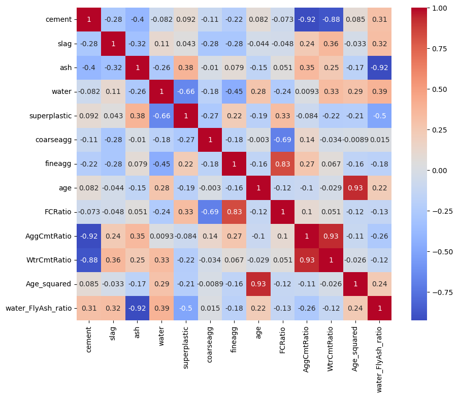
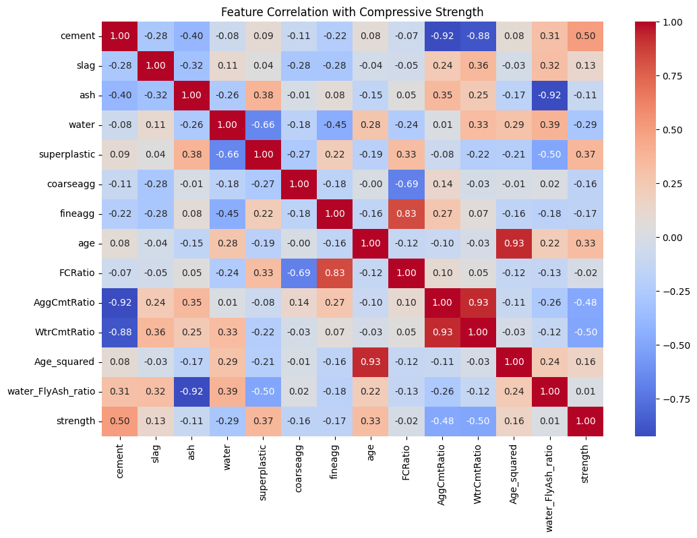
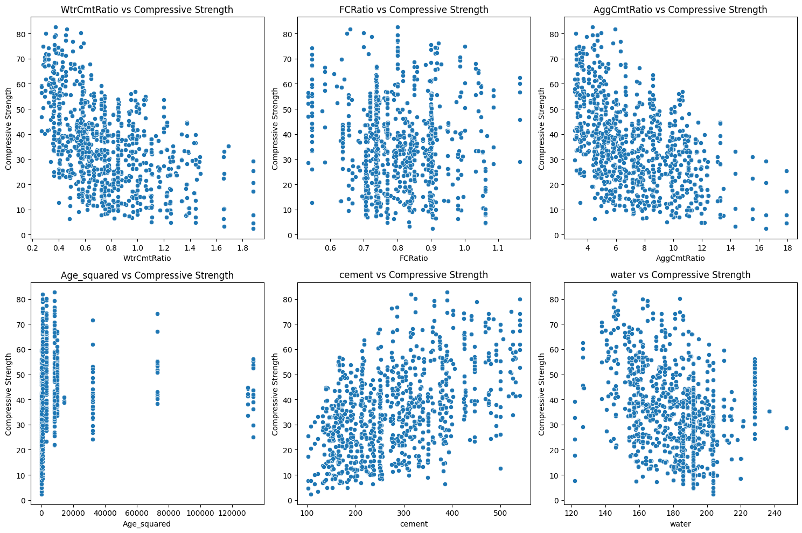
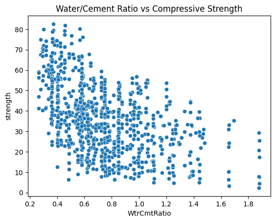
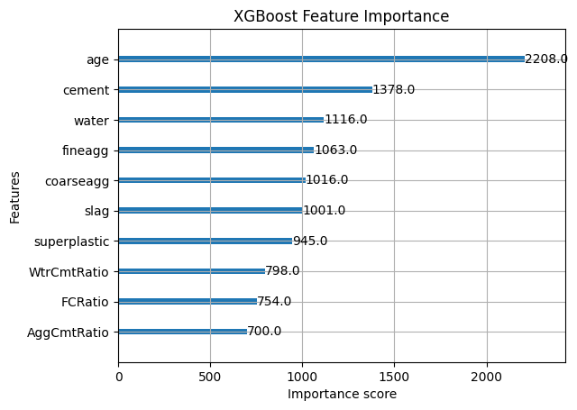

## ?? Results Overview

This project explores the predictive modeling of concrete compressive strength using multiple approaches.  
The following visuals summarize key insights, feature relationships, and model performance.

---

### Compressive Strength Distribution

The dataset shows a wide range of compressive strength values, highlighting the variability in concrete mixes and the importance of predictive modeling.

---

### Engineered Features & Relationships

Feature engineering reveals meaningful transformations and relationships that improve model accuracy, such as ratios and interaction terms.

---

### Feature Correlation with Compressive Strength

Correlation analysis identifies which raw features most strongly influence compressive strength, guiding model selection and feature importance analysis.

---

### Feature Distribution Analysis

Distribution plots show the spread and skewness of input variables, helping to detect imbalances and inform preprocessing strategies.

---

### Feature vs Target Relationships

Scatter plots illustrate how individual features relate to compressive strength, confirming expected trends (e.g., water?cement ratio).

---

### Predicted vs Actual Compressive Strength

This scatter plot compares predicted values against actual measurements.  
- Points close to the diagonal line indicate strong agreement.  
- The tight clustering demonstrates that the RandomForest model generalizes well.  
- Outliers highlight opportunities for further feature engineering or model tuning.

---

### Water-Cement Ratio vs Compressive Strength

The water?cement ratio shows a clear inverse relationship with compressive strength, confirming domain knowledge and validating feature importance results.

---

### XGBoost Feature Importance

XGBoost’s feature importance ranking highlights cement content, water ratio, and age as the most influential predictors of compressive strength.

---

### Model Comparison

We compared Linear Regression, SVR, and RandomForest models:  
- **RandomForest** achieved the highest R² = **0.87**, showing strong predictive accuracy.  
- **SVR** reached R² = **0.80**, while **Linear Regression** lagged at R² = **0.72**.  
This demonstrates the advantage of ensemble methods for this dataset.